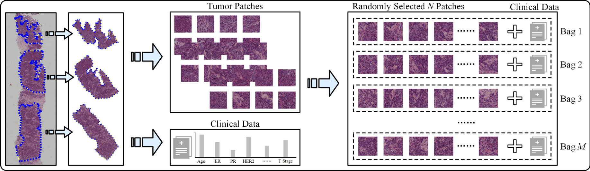

# AI competition for predicting Lymph node metastasis of breast cancer (DACON_유방암의 임파선 전이 예측 AI 경진대회)

## [배경]

- 림프절(임파선)은 암의 전이, 암이 퍼지는 데 매우 치명적인 역할을 합니다.

  병원에서 암 진단을 받았을 때 가장 많이 듣는 말이자 우리가 관심을 가져야 하는 것이 림프절 전이이며, 

  이러한 림프절 전이 여부에 따라 치료와 예후가 달라집니다.

  따라서 림프절 전이 여부와 전이 단계를 파악하는 것이 암을 치료하고 진단하는 것에 있어서 매우 핵심적인 역할을 합니다.

  

  이번 '유방암의 임파선 전이 예측 AI경진대회'에서 유방암 병리 슬라이드 영상과 임상 항목 데이터를 이용하여,

  유방암 치료에 핵심적인 역할을 할 수 있는 최적의 AI 모델을 만들어 유방암의 임파선 전이 여부를 예측해 보고자 합니다.

## [주최 / 주관]

- 주최 : 연세대학교 의과대학, JLK, MTS
- 후원 : 보건산업진흥원
- 주관 : 데이콘

## [모델링]

- MIL(Multiple Instance Learning) 방식 적용
  - 여러 개의 인스턴스(샘플)로 이루어진 가방(bag) 데이터셋을 분류하는 머신러닝 알고리즘입니다.
  - 가방 데이터셋의 인스턴스중 일부는 양(positive) 클래스에 속하고, 일부 인스턴스는 음(negative) 클래스에 속합니다.
  - 가방의 각 인스턴스를 독립적으로 분류하는 것이 아니라, 전체 가방 데이터셋을 분류합니다.
  - MIL은 의학 분야를 비롯한 다양한 분야에서 사용되는 유용한 머신러닝 기술 중 하나입니다.
- 적용 조건
  - 각 Patch의 크기는 128*128 픽셀로 Crop합니다.
  - GRAYSCALE 값이 240 이하인 펙셀의 비울이 70% 이상인 Patch만 사용합니다.
  - 각 가방에는 10개의 Patch를 담습니다.
  - 각 환자의 최소 가방 수는 10개로 부족한 Patch는 해당 환자의 Patch를 증식하여 사용합니다.

## [평가 방법]

- Macro F1 Score로 결과를 평가합니다.
- Early Stopping F1 Score는 0.95로 합니다. 

## [참조]

- https://github.com/bupt-ai-cz/BALNMP

---

## [Setup]

### Clone this repo

```bash
git clone https://github.com/zivary/DACON_AI_competition_for_predicting_Lymph_node_metastasis_of_breast_cancer.git
```

### Environment

Create environment and install dependencies.

```bash
conda create -n env python=3.8 -y
conda activate env
pip install -r ./code/requirements.txt
```

### Data Preparation

```bash
cd code
Data Preparation.ipynb
```

## Training

Our codes have supported the following experiments, whose results have been presented in our [paper and supplementary material](https://arxiv.org/abs/2112.02222).

> experiment_index:
> 
> 0. N0 vs N+(>0)
> 1. N+(1-2) vs N+(>2)
> 2. N0 vs N+(1-2) vs N+(>2)
> 3. N0 vs N+(1-2)
> 4. N0 vs N+(>2)

To run any experiment, you can do as this:

```bash
cd code
bash run.sh ${experiment_index}
```

Furthermore, if you want to try other settings, please see `train.py` for more details.

## Paper results

The results in our paper are computed based on the [cut-off value in ROC](https://en.wikipedia.org/wiki/Youden%27s_J_statistic#:~:text=Youden%27s%20index%20is,as%20informedness.%5B3%5D). For your convenient reference, we have recomputed the classification results with argmax prediction rule, where the threshold for binary classification is 0.5, and the detailed recomputed results are [here](./recompute_results.md).

### The performance in prediction of ALN status (N0 vs. N(+))

<div align="center">
    
</div>

### The performance in prediction of ALN status (N0 vs. N + (1-2))

<div align="center">
    
</div>

### The performance in prediction of ALN status (N0 vs. N + (>2))

<div align="center">
    
</div>

## Implementation details

### Data preparation

In our all experiments, the patch number (*N*) of each bag is fixed as 10, however, the bag number (*M*) for each WSI is not fixed and is dependent on the resolution of a WSI. According to our statistical results, the bag number (*M*) of WSIs varies from 1 to 300, which is not fixed for a WSI during training and testing. The process of dataset preparation is shown in the following figure, and the details are as follows:

- Firstly, we cut out annotated tumor regions for each WSI, and there may exist multiple annotated tumor regions in a WSI.

- Then, each extracted tumor region is cropped into amounts of non-overlapping square patches with a resolution of 256 \* 256, and patches with a blank ratio greater than 0.3 are filtered out.

- Finally, for each WSI, a bag is composed of randomly sampled 10 (*N*) patches, and the left patches which can not be grouped into a bag will be discarded.

The 5 clinical characteristics used in our experiments are age (numerical), tumor size (numerical), ER (categorical), PR (categorical), and HER2 (categorical), which are provided in our BCNB Dataset, and you can access them from our [BCNB Dataset](https://bupt-ai-cz.github.io/BCNB/).

<div align="center">
    
</div>

### Model testing

As mentioned above, a WSI is split into multiple bags, and each bag is inputted into the MIL model to obtain predicted probabilities. So for obtaining the comprehensive predicted results of a WSI during testing, we compute the average predicted probabilities of all bags to achieve "Result Merging".

<div align="center">
    
</div>

## Demo software

We have also provided software for easily checking the performance of our model to predict ALN metastasis.

Please download the software from [here](https://drive.google.com/drive/folders/18f0rEmV3dfdZsnFY2mfbF-MMtk9JkjZY?usp=sharing), and check the `README.txt` for usage. Please note that this software is only used for demo, and it cannot be used for other purposes.

<div align="center">
    
</div>

## Citation

If this work helps your research, please cite this paper in your publications.

```
@article{xu2021predicting,
  title={Predicting axillary lymph node metastasis in early breast cancer using deep learning on primary tumor biopsy slides},
  author={Xu, Feng and Zhu, Chuang and Tang, Wenqi and Wang, Ying and Zhang, Yu and Li, Jie and Jiang, Hongchuan and Shi, Zhongyue and Liu, Jun and Jin, Mulan},
  journal={Frontiers in oncology},
  volume={11},
  pages={759007},
  year={2021},
  publisher={Frontiers Media SA}
}
```

## Contact

If you encounter any problems, please open an issue without hesitation, and you can also contact us with the following:

- email: tangwenqi@bupt.edu.cn, czhu@bupt.edu.cn, drxufeng@mail.ccmu.edu.cn

## Acknowledgements

This project is based on the following open-source projects. We thank their authors for making the source code publically available.

- [AttentionDeepMIL](https://github.com/AMLab-Amsterdam/AttentionDeepMIL)